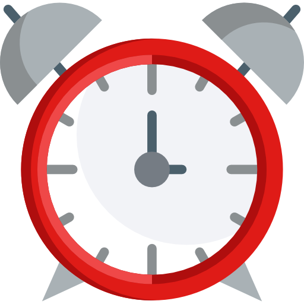

    

# countdown

⏰ Countdown mechanism + creating notes after `double click`

## Demo 🎉

<https://piecioshka.github.io/countdown/>

## Features

* :white_check_mark: Countdown passed time to 00:00
* :white_check_mark: You can **change time during countdown** by update hash
    and press ENTER
* :white_check_mark: Use **custom web font** to display awesome numbers
* :white_check_mark: **Set the red theme** when countdown completed
* :white_check_mark: **Play alarm sound** when countdown completed
* :white_check_mark: Properly works on all modern browsers
* :white_check_mark: Use [MoveMaster](https://github.com/piecioshka/move-master)
    to make elements draggable
* :white_check_mark: Create **movable note** 📒 when making a _double click_
    on the lowest layer on a document - `document.body`

## How to set time in countdown?

You can pass into URL hash as formatted time, for example:

* <https://piecioshka.github.io/countdown/#10:00>
* <https://piecioshka.github.io/countdown/#03:14>
* <https://piecioshka.github.io/countdown/#100:00>

_**Default** is one minute._

## Print screens

Start time:

End of time:

## License

[The MIT License](http://piecioshka.mit-license.org) @ 2017-2019
