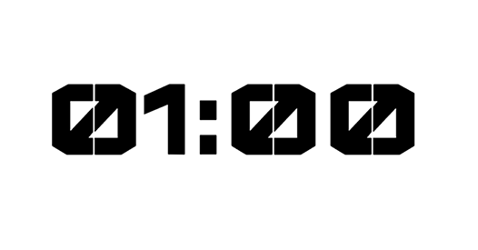
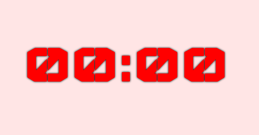

# countdown

> ⏰ Display time in countdown style

## Demo

Click: https://piecioshka.github.io/countdown/

## Features 💥

* Count down to passed time
* You can change time during counting down by update hash and press ENTER
* Use custom web font to display awesome numbers
* Set red theme when time is end
* Play alarm clock when time is end
* Properly works on all modern browsers

## How to set concrete time to countdown?

You can pass into URL hash as formatted time, for example: 

* https://piecioshka.github.io/countdown/#10:00
* https://piecioshka.github.io/countdown/#03:14
* https://piecioshka.github.io/countdown/#100:00

**Default** is one minute.

## Print screens

Start time:

End of time:

## License

[The MIT License](http://piecioshka.mit-license.org) @ 2017
