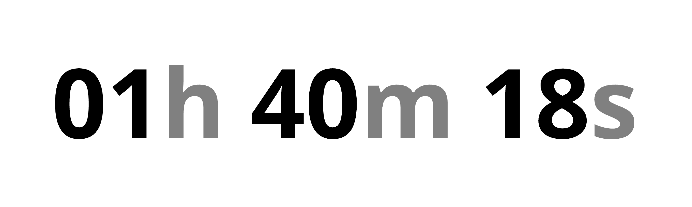

    

# countdown

⏰ A simple, visual countdown timer that runs in your browser

## Preview 🎉

<https://piecioshka.github.io/countdown/>

## Features

- ✅ Counts down to `00:00` with large, legible digits
- ✅ Lets you adjust the remaining time mid-countdown via the URL hash (press `Enter` to apply)
- ✅ Automatically switches to a red alert theme when time runs out
- ✅ Plays an alarm sound the moment the countdown completes
- ✅ Uses [MoveMaster](https://github.com/piecioshka/move-master) for drag-and-drop interactions
- ✅ Double-click empty space to spawn movable sticky notes 📒 on `document.body`

## How to set time in countdown?

Provide the target time in the URL hash using `SS`, `MM:SS`, or `HH:MM:SS` formats:

- <https://piecioshka.github.io/countdown/> – default `01:00` (1 minute, 0 seconds)
- <https://piecioshka.github.io/countdown/#45> – 45 seconds
- <https://piecioshka.github.io/countdown/#10:00> – 10 minutes, 0 seconds
- <https://piecioshka.github.io/countdown/#03:14> – 3 minutes, 14 seconds
- <https://piecioshka.github.io/countdown/#02:15:00> – 2 hours, 15 minutes, 0 seconds
- <https://piecioshka.github.io/countdown/#100:00> – 1 hour, 40 minutes

## Screenshots

In progress:

Completed:

## License

[The MIT License](http://piecioshka.mit-license.org) @ 2026
