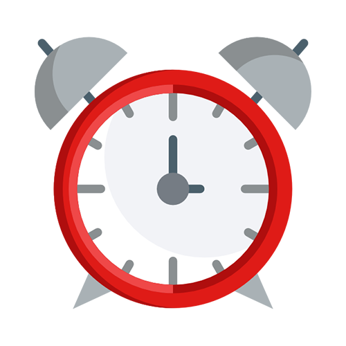

    

# countdown

⏰ Countdown mechanism + creating stickers after `double click`

## Preview 🎉

<https://piecioshka.github.io/countdown/>

## Features

* ✅ Countdown passed time to 00:00
* ✅ You can **change time during countdown** by update hash
    and press ENTER
* ✅ Use **custom web font** to display awesome numbers
* ✅ **Set the red theme** when countdown completed
* ✅ **Play alarm sound** when countdown completed
* ✅ Properly works on all modern browsers
* ✅ Use [MoveMaster](https://github.com/piecioshka/move-master)
    to make elements draggable
* ✅ Create **movable note** 📒 when making a _double click_
    on the lowest layer on a document - `document.body`

## How to set time in countdown?

You can pass into URL hash as formatted time, for example:

* <https://piecioshka.github.io/countdown/> - This will start countdown from `01:00`
* <https://piecioshka.github.io/countdown/#10:00>
* <https://piecioshka.github.io/countdown/#03:14>
* <https://piecioshka.github.io/countdown/#100:00>

## Print screens

Start time:

End of time:

## License

[The MIT License](https://piecioshka.mit-license.org) @ 2017
